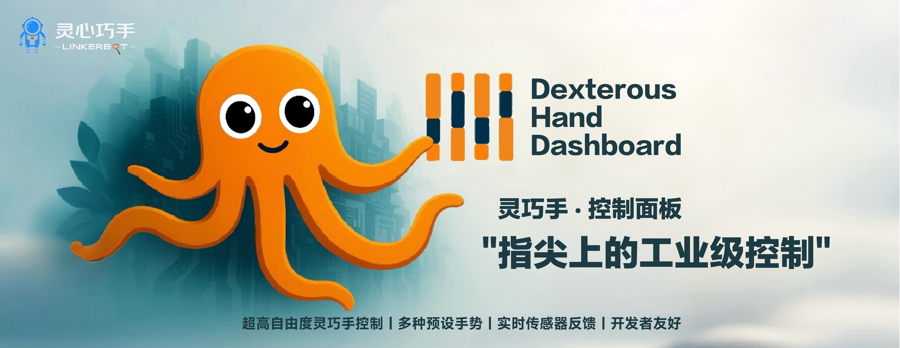

# 🚀 Dexterous Hand Linker Hand L10/O7 Control Panel

[中文文档](README_CN.md)

A web-based dexterous hand control panel supporting both L10 and O7 device models, providing an intuitive graphical interface to control robotic hand finger joints, palm postures, and animation effects.

## 🚀 Key Features

### Device Support
- **L10 Model**: Supports 6 joint control (5 fingers + 1 palm joint)
- **O7 Model**: Supports 7 joint control (7 independent joints)
- **Automatic Device Detection**: Intelligently recognizes connected device types
- **Dynamic Device Switching**: Switch between L10/O7 modes at runtime

### Hand Configuration Management
- **Multi-hand Support**: Simultaneously control multiple CAN interface hands
- **Left/Right Hand Configuration**: Each hand can be independently configured as left or right
- **CAN ID Management**: Automatic allocation and management of CAN IDs (left hand 0x28, right hand 0x27)
- **Real-time Status Monitoring**: Display connection status of each hand

### Control Functions
- **Real-time Joint Control**: Slider control for each joint position (0-255)
- **Preset Poses**: Built-in common gestures (fist, open, pinch, etc.)
- **Numeric Gestures**: Support for 1-9 numeric gestures
- **Animation System**: Wave animations, swing animations, etc.
- **Speed Control**: O7 devices support independent joint speed control

### Advanced Features
- **Refill Core**: Special joint sequence animation
- **O7 Exclusive Animations**: Ripple animation, fingertip dance, conductor, etc.
- **Six-hand Sequential Animation**: Support for multi-hand coordinated animations
- **Device Type Detection**: Automatic detection and adaptation of device types

## 📋 System Requirements
#### System Runtime Requirements
- Golang environment (1.20+)
- CAN bus interface
- Linux system (for CAN interface configuration)

## 🛠️ Installation and Configuration

### 1. Clone Project
```bash
git clone <repository-url>
cd dexterous-hand-dashboard
```

### 2. Install Dependencies
```bash
go mod tidy
```

### 3. Configure CAN Interface
```bash
# Start CAN interface
sudo ip link set can0 up type can bitrate 1000000
sudo ip link set can1 up type can bitrate 1000000
```

### 4. Start Service

#### Startup Method
Start control service:
```bash
go run main.go -can-url http://localhost:5260 -port 9099
```
#### Logging and Monitoring
The service provides detailed log output, including interface status, action sending status, and error prompts for quick diagnosis and troubleshooting.

## ⚙️ Configuration Parameters

### Command Line Arguments
- `-can-url`: CAN service URL (default: http://localhost:5260)
- `-port`: Web service port (default: 9099)
- `-interface`: Default CAN interface
- `-can-interfaces`: Supported CAN interface list (comma-separated)
- `-device-type`: Device type (L10 or O7)

### Environment Variables
- `CAN_SERVICE_URL`: CAN service URL
- `WEB_PORT`: Web service port
- `DEFAULT_INTERFACE`: Default CAN interface
- `CAN_INTERFACES`: Supported CAN interface list
- `DEVICE_TYPE`: Device type

## 🎮 Usage Guide

### Basic Operations

1. **Start Control Panel**
   - Visit `http://localhost:9099`
   - Wait for system initialization to complete

2. **Configure Hands**
   - Select hands to enable in the "Hand Configuration Management" area
   - Set interface and hand type (left/right) for each hand
   - Check connection status

3. **Device Type Settings**
   - Use device type selector to switch between L10/O7 modes
   - Or use "Auto Detect" feature to automatically identify device type

### Joint Control

#### L10 Device (6 joints)
- **Joints 1-5**: Finger joint control
- **Palm Control**: Independent palm joint control panel

#### O7 Device (7 joints)
- **Joints 1-7**: 7 independent joint controls

### Preset Poses

#### Basic Gestures
- **Fist**: Fully closed state
- **Open**: Fully open state
- **Pinch**: Thumb and index finger pinch pose
- **Point**: Extended index finger pointing
- **Thumbs Up**: Thumbs up gesture

#### Numeric Gestures
- **1-9**: Corresponding numeric gestures
- **Auto Demo**: Sequential display of all numeric gestures

#### Special Gestures
- **Yeah**: Victory gesture
- **Yo**: Greeting gesture
- **PONG**: Gun gesture
- **OK**: OK gesture

### Animation Control

#### Basic Animations
- **Wave Animation**: Fingers open and close sequentially
- **Horizontal Swing**: Palm swings left and right

#### O7 Exclusive Animations
- **Ripple Animation**: Joints activate sequentially
- **Fingertip Dance**: Complex joint coordination movements
- **Conductor**: Simulated conducting movements
- **Finger Wave**: 7-joint wave effect

### Advanced Features

#### Refill Core
- **L10 Mode**: Palm and finger coordination action sequence
- **O7 Mode**: 7-joint sequential activation sequence

#### Six-hand Sequential Animation
- **Mexican Wave**: Multi-hand coordinated wave
- **Numeric Countdown**: Multi-hand numeric display
- **Bidirectional Wave**: Forward and reverse waves

## 🔧 API Interfaces

### Basic Interfaces
- `GET /api/health`: Health check
- `GET /api/status`: System status
- `GET /api/interfaces`: Available interface list
- `GET /api/device-type`: Device type information

### Control Interfaces
- `POST /api/fingers`: Send finger poses
- `POST /api/palm`: Send palm poses
- `POST /api/speeds`: Send joint speeds (O7)
- `POST /api/animation`: Control animations
- `POST /api/preset/{pose}`: Set preset poses

### Configuration Interfaces
- `POST /api/hand-type`: Set hand type configuration
- `GET /api/hand-configs`: Get hand type configurations
- `GET /api/sensors`: Get sensor data

## 🐛 Troubleshooting

### Common Issues

1. **CAN Service Connection Failure**
   - Check if CAN service is running
   - Verify network connection and URL configuration
   - Ensure CAN interface is properly configured

2. **Device Type Detection Failure**
   - Ensure hands are enabled and connected
   - Manually select correct device type
   - Check device firmware version

3. **Control Commands Not Responding**
   - Check hand connection status
   - Verify CAN ID configuration
   - Ensure device type setting is correct

4. **Animation Effects Abnormal**
   - Check if device type matches
   - Verify joint count settings
   - Ensure animation parameters are reasonable

### Debug Features

- **System Debug**: Click "🔍 System Debug" button
- **Status Monitoring**: View real-time status logs
- **Network Check**: Automatic network connection status detection

## 📝 Update Log

### v2.0.0 (Current Version)
- ✨ Added O7 device support
- ✨ Added 7-joint control functionality
- ✨ Implemented automatic device type detection
- ✨ Added O7 exclusive animation effects
- ✨ Added joint speed control
- ✨ Optimized left/right hand switching logic
- ✨ Improved device type display
- 🐛 Fixed hand type configuration synchronization issues
- 🐛 Fixed device type detection logic

### v1.0.0
- ✨ Basic L10 device support
- ✨ 6-joint control functionality
- ✨ Preset pose system
- ✨ Basic animation effects
- ✨ Multi-hand support

## 🤝 Contribution Guidelines

Welcome to submit Issues and Pull Requests to improve this project!

## 📄 License

This project uses the MIT License - see the [LICENSE](LICENSE) file for details.

## 📞 Support

For questions or suggestions, please contact us through:
- Submit GitHub Issues
- Send email to project maintainers

---

**Note**: Please ensure CAN interfaces and network connections are properly configured before use. It is recommended to verify functionality in a test environment before deploying to production.